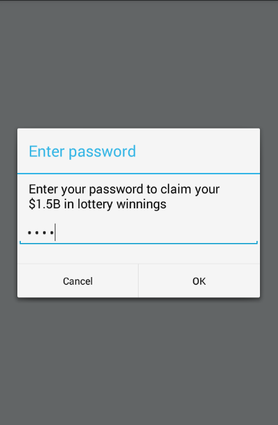
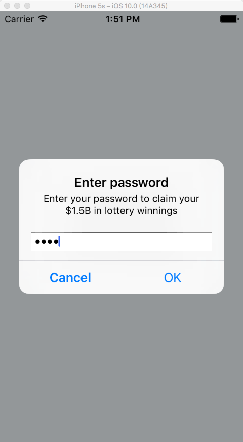

# react-native-prompt-android
A polyfill library for Alert.prompt on Android platform, working both on Android and iOS platform(iOS using [AlertIOS.prompt](http://facebook.github.io/react-native/docs/alertios.html#prompt))


### Installation

* Install from npm

```bash
npm i react-native-prompt-android --save
```

* Link native library

You can use react-native-cli:
```bash
react-native link react-native-prompt-android
```

Or rnpm:
```bash
rnpm link react-native-prompt-android
```

### Usage

```
import prompt from 'react-native-prompt-android';
prompt(
    'Enter password',
    'Enter your password to claim your $1.5B in lottery winnings',
    [
     {text: 'Cancel', onPress: () => console.log('Cancel Pressed'), style: 'cancel'},
     {text: 'OK', onPress: password => console.log('OK Pressed, password: ' + password)},
    ],
    {
        type: 'secure-text',
        cancelable: false,
        defaultValue: 'test',
        placeholder: 'placeholder'
    }
);
```

## Props

 name                 | description                                 | type     | default
:-------------------- |:------------------------------------------- | --------:|:------------------
 type                 | Text input type: `'numeric', 'secure-text', 'phone-pad', 'email-address'`  |   String | 'default'
 cancelable           |                                             |  Boolean |
 defaultValue         | Default input value                         |   String | ''
 keyboardType         | The keyboard type of first text field(if exists). One of `'default'`, `'email-address'`, `'numeric'`, `'phone-pad'`, `'ascii-capable'`, `'numbers-and-punctuation'`, `'url'`, `'number-pad'`, `'name-phone-pad'`, `'decimal-pad'`, `'twitter'` or `'web-search'`. | String | 'default'
 placeholder          |                                             |   String | ''





